# 🐻 DuckBear E-pasta Tīmekļa Vietne Java PD 🦆

Vienkārša Java programma, kas simulē e-pasta sistēmu ar lietotāju reģistrāciju, autorizēšanos un vēstuļu sūtīšanu.

---

## Funkcijas
- Lietotāju reģistrācija un autorizācija  
- Vēstuļu sūtīšana starp lietotājiem  
- Lietotāja profila skatīšana un dzēšana  
- GUI ar `JOptionPane`

---

## Attēli

   
  <i>DuckBear logo</i>

 

  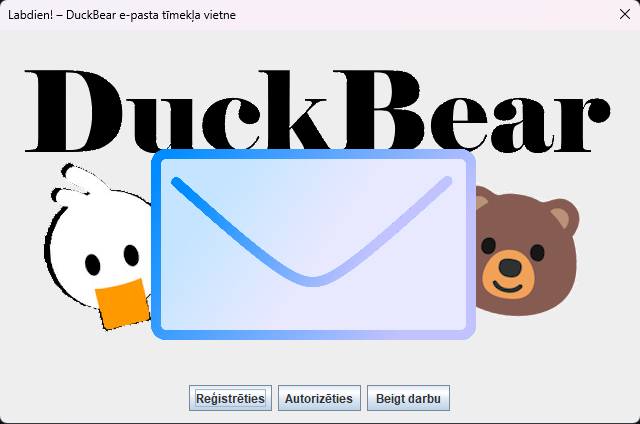 
  <i>Sākuma logs</i>

  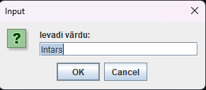
  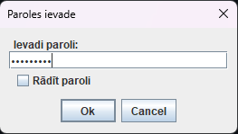
  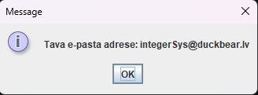

   
  <i>Reģistrācija un e-pasta izveidošana</i>

  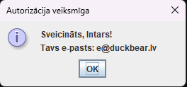 
  <i>Autorizācijas paziņojums</i>

  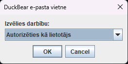 
  <i>Autorizācijas logs</i>

  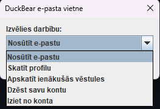 
  <i>Lietotāja izvēlne</i>

  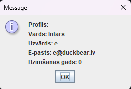
  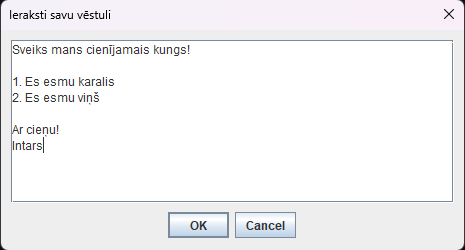
  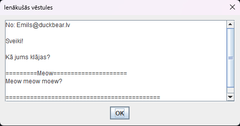

   
  <i>Lietotāja profila skatīšana, vēstules sūtīšana un skatīšana</i>

 

  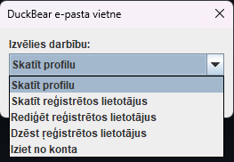 
  <i>Administratora izvēlne</i>

---
## Kredīti

`Programmētāji: Emīls Smirnovs 2PT, Gustavs Lācis 2PT`

---

# Superklase - Tīmekļa Vietnes PD

## Darāmie darbi:
- [x] Sākt izstrādi OOP vidē, izmantojot iekapsulēšanas (Java Bean) un mantošanas principus
- [x] Ieviest JOptionPane
- [x] Ieviest ievaddatu validāciju
- [x] Nodrošināt galvenajā klasē (TimeklaVietne) iespēju izveidot jaunus klašu objektus, apskatīt tos, dzēst tos
- [x] Nodrošināt iespēju izsaukt klasēm raksturojošās metodes
